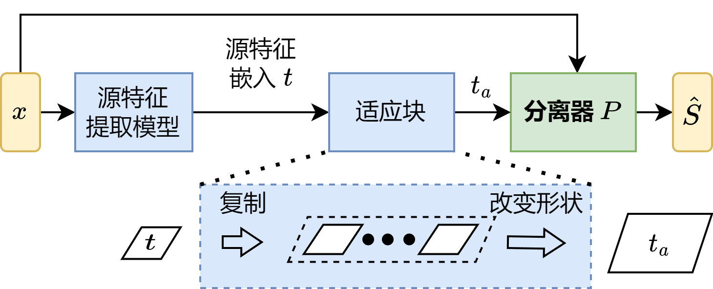
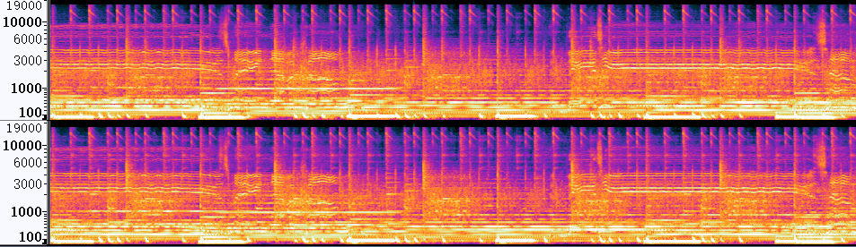
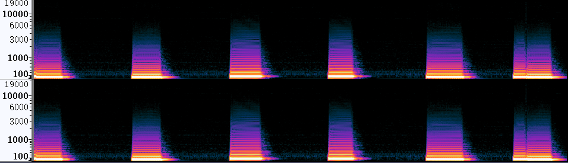
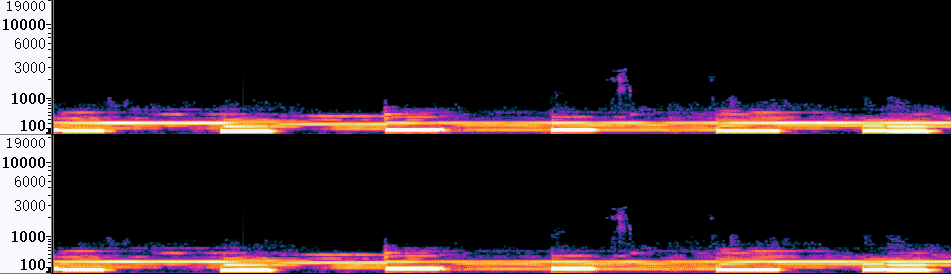
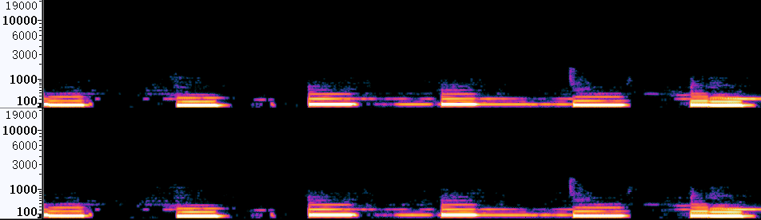
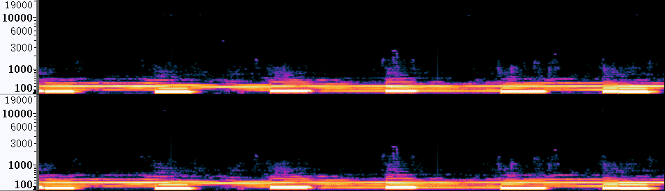
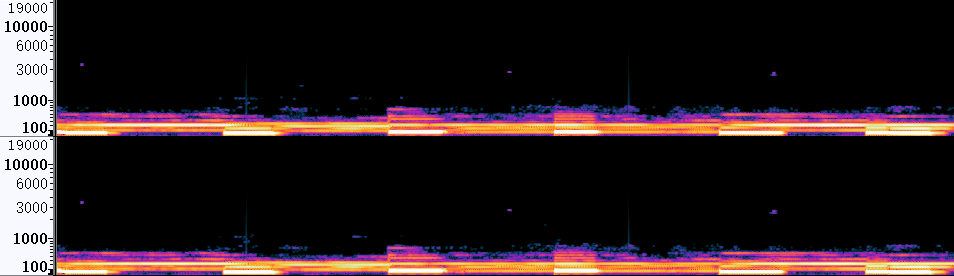
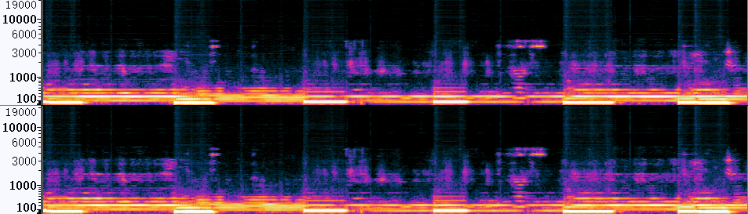
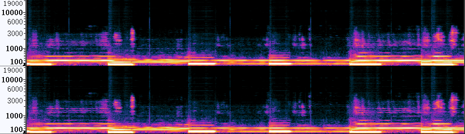

# 基于乐器特征提取的音乐源分离技术

## Demo展示网页

#### _李陈依_

### 介绍

与 [VocEmb4SVS 框架](http://www.apsipa.org/proceedings/2022/APSIPA%202022/TuAM1-7/1570836845.pdf)所述的思想一样，本技术尝试对音乐源分离技术的待分离目标源的特征进行提取，用该源特征嵌入来指导系统的分离。系统框架图如下图所示：

图中的“源特征提取模型”表示乐器特征提取模型，$t$是提取得到的乐器特征嵌入（source embedding），而 $𝑡_𝑎$表示经过适应块处理得到的适应任意分离网络指定隐藏层输入形状的适应性源特征嵌入。

本技术将尝试对多种乐器进行分离，使用的数据集根据乐器的种类而有所不同。其中，对`drums`, `bass`使用[`MUSDB18`]([MUSDB18 | SigSep](https://sigsep.github.io/datasets/musdb.html#musdb18-compressed-stems))   数据集，对`piano`和管弦乐等使用华为内部自购数据。

#### Bass

> 本部分的案例名称含义如下：
> 
> - `Mixture`：原始混合音乐；
> 
> - `ResUNetDecouple+`和`HDemucs`表示仅使用ResUNetDecouple+模型或HDemucs分离混合音乐`Mixture`得到bass乐器声；
> 
> - 向ResUNetDecouple+模型中引入bass特征嵌入的不同方法：
>   
>   - `Res_fnt`：向ResUNetDecouple+模型中引入微调后(`fnt`)的bass乐器分类特征嵌入；
>   
>   - `Res_tim_sep_fnt`：向ResUNetDecouple+模型中引入微调后(`fnt`)的bass乐器音色(`tim`)特征嵌入，其特征嵌入经过预分离网络之后提取得到(`sep`);
>   
>   - `Res_clstim_sep_pre`：向ResUNetDecouple+模型中引入预训练好的(`pre`)的bass乐器联合(`clstim`)特征嵌入，其特征嵌入经过预分离网络之后提取得到(`sep`);
> 
> - 向HDemucs模型中引入bass特征嵌入的不同方法：
>   
>   - `HD_fnt`：向HDemucs模型中引入微调后(`fnt`)的bass乐器分类特征嵌入。

##### Case 1

<table style="margin: 0,auto; align:center; vertical-align:middle; border: none!important">
    <tr>
        <td align='center'> <b>Mixture</b> </td>
        <td> </td>
    </tr>
    <tr>
      <td align='center'> <b>Reference</b> </td>
        <td> </td>
    </tr>
    <tr>
      <td align='middle'> <b>ResUNetDecouple+</b> </td>
        <td> </td>
    </tr>
    <tr>
        <td align='center'> <b>Res_fnt</b> </td>
        <td> </td>
    </tr>
    <tr>
        <td align='center'> <b>Res_tim_sep_fnt</b> </td>
        <td> </td>
    </tr>
    <tr>
        <td align='center'> <b>Res_clstim_sep_pre</b> </td>
        <td> </td>
    </tr>
    <tr>
      <td align='center'> <b>HDemucs</b> </td>
        <td> </td>
    </tr>
    <tr>
      <td align='center'> <b>HD_fnt</b></td>
        <td> </td>
    </tr>
</table>
  
  
 
<table style="margin-left: auto; margin-right: auto; align:center; border: none!important; width: 100%">
    <tr>
        <td align='center'>Mixture</td>
        <td align='center'>ResUNetDecouple+</td>
        <td align='center'>Res_fnt</td>
    </tr>
    <tr>
    	<td align='center' width='30%'>
        <audio controls>
            <source src="./data/bass/SpeakSoftly-BrokenMan_mix_1.wav" type="audio/wav">
            Your browser does not support the audio element.
        </audio>
        </td>
    	<td align='center' width='30%'>
        <audio controls>
            <source src="./data/bass/SpeakSoftly-BrokenMan_Res_1.wav" type="audio/wav">
            Your browser does not support the audio element.
        </audio>
        </td>
    	<td align='center' width='30%'>
        <audio controls>
            <source src="./data/bass/SpeakSoftly-BrokenMan_Res_fnt_1.wav" type="audio/wav">
            Your browser does not support the audio element.
        </audio>
        </td>
    </tr>
	<tr>
        <td align='center'>Res_tim_sep_fnt</td>
        <td align='center'>Res_clstim_sep_pre</td>
        <td align='center'> </td>
    </tr>
    <tr>
    	<td align='center' width='30%'>
        <audio controls>
            <source src="./data/bass/SpeakSoftly-BrokenMan_Res_tim_sep_fnt_1.wav" type="audio/wav">
            Your browser does not support the audio element.
        </audio>
        </td>
    	<td align='center' width='30%'>
        <audio controls>
            <source src="./data/ResUNet_Shore_08bass/SpeakSoftly-BrokenMan_Res_clstim_sep_pre_1.wav" type="audio/wav">
            Your browser does not support the audio element.
        </audio>
        </td>
    	<td align='center' width='30%'>
         
        </td>
    </tr>
    <tr>
    <td align='center'>Reference</td>
    <td align='center'>HDemucs</td>
    <td align='center'>HD_fnt</td>
    </tr>
    <tr>
        <td align='center' width='30%'>
        <audio controls>
            <source src="./data/bass/SpeakSoftly-BrokenMan_bass_1.wav" type="audio/wav">
            Your browser does not support the audio element.
        </audio>
        </td>
        <td align='center' width='30%'>
        <audio controls>
            <source src="./data/bass/SpeakSoftly-BrokenMan_HD_1.wav" type="audio/wav">
            Your browser does not support the audio element.
        </audio>
        </td>
        <td align='center' width='30%'>
        <audio controls>
            <source src="./data/bass/SpeakSoftly-BrokenMan_HD_fnt_1.wav" type="audio/wav">
            Your browser does not support the audio element.
        </audio>
        </td>
    </tr>
    </table>

    
